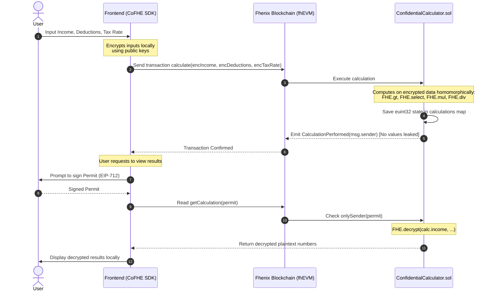

# Understanding FHE Implementation in SafeCompute

This document explains how **Fully Homomorphic Encryption (FHE)** is implemented in this project (specifically in Phase 2) and provides instructions on how to set up, run, and interact with the application.

---

## 1. Transparent vs. Confidential Computation

In traditional public blockchains (like Ethereum), all smart contract states, inputs, and outputs are public. This creates a massive privacy issue for sensitive applications like financial modeling, tax calculation, or identity management.

### Phase 1: Transparent Estimator (`TransparentCalculator.sol`)
* **Inputs & State:** Receives raw inputs (`uint256`) and stores them in a public map.
* **Leakage:** Every node operator, validator, and block explorer can see your exact income, deductions, and net wealth.
* **Events:** Emits public events containing all calculation results, broadcasting your private financial details to the entire network.

### Phase 2: Confidential Estimator (`ConfidentialCalculator.sol` + FHE)
* **Inputs & State:** Receives encrypted parameters (`inEuint32`) and stores them as FHE-shielded types (`euint32`).
* **Privacy:** All calculations are performed on encrypted data without ever exposing the underlying values.
* **Access Control:** Only the owner of the data can decrypt and view it, verified through cryptographic signatures (Permits).

---

## 2. Technical Implementation Details (Phase 2)

This project implements FHE by utilizing the **Fhenix fhEVM** framework, splitting operations between the smart contracts (on-chain) and the React/Next.js frontend (off-chain).



### A. On-Chain Smart Contract (`ConfidentialCalculator.sol`)
1. **Encrypted Data Types**: Instead of using standard integer types like `uint256`, the contract uses `euint32` (encrypted 32-bit unsigned integer) representing FHE-encrypted values, and `ebool` for encrypted booleans.
2. **Importing FHE Libraries**: 
   ```solidity
   import "@fhenixprotocol/contracts/FHE.sol";
   import "@fhenixprotocol/contracts/access/Permissioned.sol";
   ```
3. **Homomorphic Operations**: The contract evaluates calculations without decrypting the data. The Fhenix library performs the math under the hood:
   * **Comparison**: `ebool isGreater = FHE.gt(income, deductions);`
   * **Conditional Branching**: `euint32 taxableIncome = FHE.select(isGreater, FHE.sub(income, deductions), FHE.asEuint32(0));`
   * **Multiplication**: `euint32 product = FHE.mul(taxableIncome, taxRate);`
   * **Division**: `euint32 taxLiability = FHE.div(product, FHE.asEuint32(100));`
4. **Confidential Storage**:
   ```solidity
   struct EncryptedCalculation {
       euint32 income;
       euint32 deductions;
       euint32 taxRate;
       euint32 taxableIncome;
       euint32 taxLiability;
       euint32 netWealth;
   }
   mapping(address => EncryptedCalculation) private calculations;
   ```
5. **Permissioned Decryption**: To view the data, the contract checks a permit (a signature proving ownership of the address) and returns the decrypted values to the authorized caller:
   ```solidity
   function getCalculation(Permission calldata permit) 
       external view onlySender(permit) returns (...) {
       EncryptedCalculation memory calc = calculations[msg.sender];
       return (
           FHE.decrypt(calc.income),
           FHE.decrypt(calc.deductions),
           FHE.decrypt(calc.taxRate),
           FHE.decrypt(calc.taxableIncome),
           FHE.decrypt(calc.taxLiability),
           FHE.decrypt(calc.netWealth)
       );
   }
   ```

### B. Off-Chain Frontend (`page.tsx`)
1. **Initialization**: The frontend dynamically imports the `@cofhe/sdk` to construct an FHE-aware client connected to the **Fhenix Helium Testnet**:
   ```typescript
   import('@cofhe/sdk/web').then((sdkWeb) => {
       const config = sdkWeb.createCofheConfig({ ... });
       const client = sdkWeb.createCofheClient(config);
       setFheClient(client);
   });
   ```
2. **Local Encryption**: Before transmitting any details to the blockchain, the frontend encrypts them using the Fhenix network public parameters:
   ```typescript
   const encrypted = await fheClient.encryptInputs([
       Encryptable.uint32(Number(privIncome)),
       Encryptable.uint32(Number(privDeductions)),
       Encryptable.uint32(Number(privTaxRate))
   ]).execute();
   ```
3. **Transaction Execution**: The resulting encrypted bytes are sent as transaction inputs to the contract's `calculate` function.
4. **EIP-712 Permit Decryption**: When the user wants to read their results, the frontend requests an EIP-712 signature from their wallet:
   ```typescript
   const permit = await fheClient.permits.getOrCreateSelfPermit();
   const permission = fheClient.permits.getPermission(permit);
   
   const data = await publicClient.readContract({
       address: CONFIDENTIAL_CALCULATOR_ADDRESS,
       abi: CONFIDENTIAL_CALCULATOR_ABI,
       functionName: 'getCalculation',
       args: [permission],
       account: address,
   });
   ```

---

## 3. How to Use & Run This Project

Follow these steps to run the contracts and run the frontend dashboard.

### Prerequisites
- **Node.js** (v18 or higher recommended)
- A browser wallet (e.g., **MetaMask**) configured to use the **Fhenix Helium Testnet**:
  * **Network Name**: Fhenix Helium
  * **RPC URL**: `https://api.helium.fhenix.zone`
  * **Chain ID**: `8008135`
  * **Currency Symbol**: `tFHE`
  * **Block Explorer**: `https://explorer.helium.fhenix.zone`
- Some testnet `tFHE` tokens (can be acquired from the [Fhenix Helium Faucet](https://faucet.fhenix.zone)).

---

### Step 1: Set Up & Run Smart Contracts
Go to the `contracts` directory, install packages, and compile/test the code:

1. **Install Dependencies**:
   ```bash
   cd contracts
   npm install
   ```
2. **Compile the Contracts**:
   ```bash
   npx hardhat compile
   ```
3. **Run Tests**:
   ```bash
   npx hardhat test
   ```

To deploy the contracts to the Fhenix Helium network, write or use a Hardhat deployment script configured in your `hardhat.config.js` pointing to the Fhenix Helium RPC:
```bash
npx hardhat run scripts/deploy.js --network helium
```
*(After deploying, copy the deployed addresses and update them in [contracts.ts](file:///Users/moinuddin9777/experiments/buidl/fhenix_buildation/frontend/src/config/contracts.ts).)*

---

### Step 2: Set Up & Run Frontend
Navigate to the `frontend` directory, install dependencies, and start the development server:

1. **Install Dependencies**:
   ```bash
   cd frontend
   npm install
   ```
2. **Start Dev Server**:
   ```bash
   npm run dev
   ```
3. **Open the Web App**:
   Visit [http://localhost:3000](http://localhost:3000) in your browser.

---

### Step 3: Interacting with the Dashboard
1. **Connect Wallet**: Click the "Connect Wallet" button at the top-right corner and select your wallet.
2. **Select Estimator**:
   * **Transparent Estimator (Phase 1)**: Submits standard inputs and records calculations publicly on-chain.
   * **Confidential Estimator (Phase 2)**: Locally encrypts inputs, runs FHE computations on the Fhenix blockchain, and shields state records.
3. **Perform Calculation**:
   * Input your *Annual Income*, *Deductions*, and *Tax Rate*.
   * Click **Calculate Publicly** (for transparent) or **Encrypt & Submit (FHE)** (for confidential).
   * Confirm the transaction signature request in your wallet.
4. **Decrypt FHE Result**:
   * Under the **Encrypted State Explorer**, you will see encrypted hashes for your values.
   * Click **Decrypt On-Chain Result (Sign Permit)**.
   * Sign the EIP-712 permit payload in your wallet.
   * The application retrieves the plaintext values from the contract and displays them locally.
