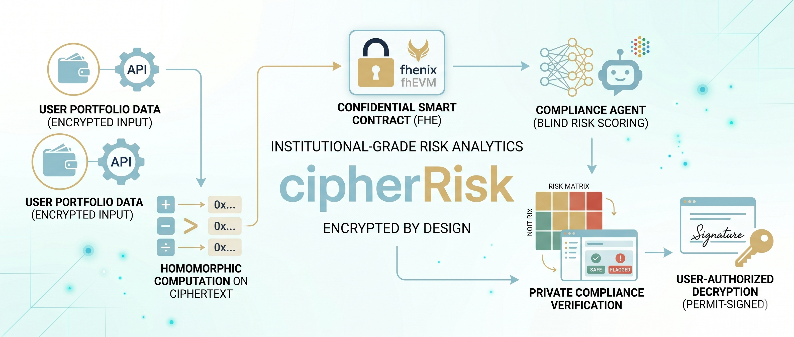
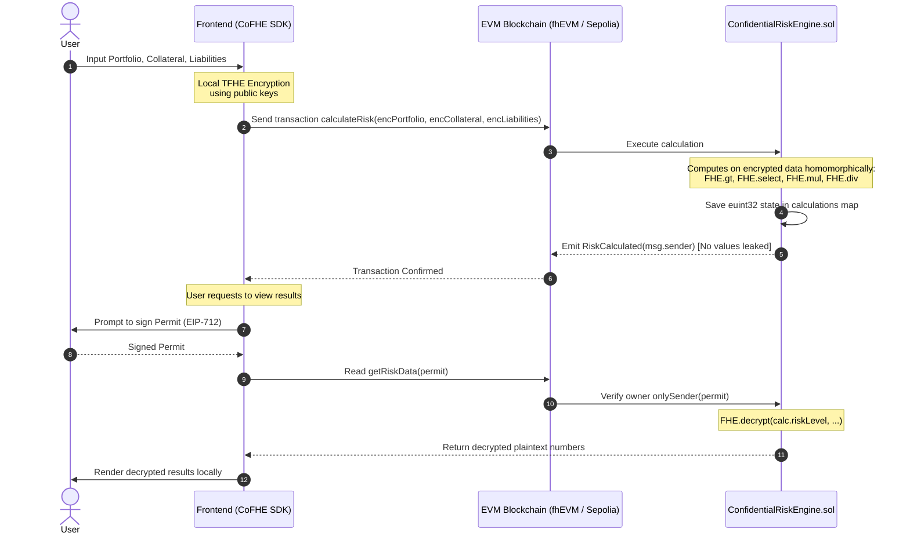

# CipherRisk: Private Institutional Risk Analytics Engine



> **"Keep your financial models private. Keep your calculations secure on-chain."**

**CipherRisk** is a state-of-the-art institutional-grade risk assessment and financial analytics platform. Traditional blockchains force a trade-off: to calculate complex metrics like leverage ratios, net asset values, or risk thresholds, contracts require raw inputs, exposing confidential business metrics, user wallet balances, and proprietary positions to public explorers, validators, and front-running bots.

By utilizing **Fully Homomorphic Encryption (FHE)** via the Fhenix fhEVM, CipherRisk breaks this paradigm. It allows smart contracts to ingest encrypted parameters, compute complicated portfolio math homomorphically, and store the resulting risk parameters in a cryptographically shielded state. The underlying data remains completely secret to all external observers—including validators and node operators—while remaining fully composable and verifiable on-chain.

---

## 💡 The Problem: Web3 Financial Doxxing

In public EVM networks (like Ethereum or Sepolia), contract states and inputs are completely transparent:
* **The Position Leakage:** Calculating leverage ratios, total asset allocations, or net worth on-chain exposes every detail of your treasury to competitor analytics and front-runners.
* **UX/Complexity Barrier:** Traditional privacy solutions like Zero-Knowledge Proofs (ZKP) require heavy client-side computation and struggle to interact with a shared global state natively.
* **Harvesting Risk:** Users are forced to rely on centralized Web2 aggregators that ingest, log, and harvest sensitive financial credentials.

---

## 🚀 The Solution: CipherRisk Pillars

CipherRisk offers a seamless, zero-knowledge-like privacy experience without local computation overhead:

### 1. Fully Homomorphic Computation
Arithmetic computations (evaluating leverage ratios, Net Asset Value, and risk scores) and relational evaluations (checking if collateral values are below threshold limits) are executed natively on encrypted data types.

### 2. Signature-Based Self-Sovereign Permits (EIP-712)
Your financial position data is stored securely on the ledger in an encrypted format. Only you can view your unsealed results. Decryption queries are authenticated off-chain through EIP-712 cryptographic permit signatures.

### 3. Developer Console & Real-time Auditing
An integrated trace panel displays the step-by-step lifecycles of FHE encryption, ZK parameter packing, contract transactions, and signature-based unsealing.

---

## 🛠️ Transparent vs. Confidential Architecture

CipherRisk showcases a side-by-side comparison illustrating the shift in Web3 privacy:

| Security Parameter | Transparent Risk Engine | Confidential Risk Engine |
| :--- | :--- | :--- |
| **Transaction Inputs** | Raw Plaintext (`uint256`) | Encrypted Ciphertext (`inEuint32`) |
| **On-Chain Storage** | Publicly viewable integers | Shielded FHE state (`euint32`) |
| **Etherscan/Explorer** | Exposed balances & variables | Invisible inputs & empty event logs |
| **Data Decryption** | Open to public inspection | Restricted to the owner via Permit signatures |

---

## 📐 FHE Execution Flow



---

## 📂 Project Structure

```bash
├── contracts/               # Hardhat smart contract development environment
│   ├── contracts/
│   │   ├── TransparentRiskEngine.sol   # Publicly transparent risk calculator
│   │   └── ConfidentialRiskEngine.sol  # FHE-shielded risk engine
│   └── scripts/deploy.js               # Contract deployment script
└── frontend/                # Next.js 16 (Turbopack) dashboard frontend
    ├── src/
    │   ├── app/page.tsx               # Main Dashboard UI & FHE integration
    │   ├── components/
    │   │   └── Web3Provider.tsx       # Wagmi & ConnectKit client setup
    │   └── config/contracts.ts        # Contract addresses & ABIs
```

---

## 🚀 Setup & Installation

### Prerequisites
* **Node.js** (v18 or higher recommended)
* A Web3 Wallet (e.g. **MetaMask**) configured to use the **Ethereum Sepolia** network.

### 1. Smart Contracts Configuration
Go to the contracts directory, install dependencies, and build:
```bash
cd contracts
npm install
npx hardhat compile
```

Deploying to Sepolia:
```bash
PRIVATE_KEY=your_private_key npx hardhat run scripts/deploy.js --network sepolia
```

### 2. Frontend Configuration
Go to the frontend directory, install dependencies, and run locally:
```bash
cd frontend
npm install --legacy-peer-deps
npm run dev
```

Open your browser and navigate to [http://localhost:3000](http://localhost:3000) to view the application dashboard.

---

## 🔒 Security & Decenteralization Guarantees
CipherRisk relies on mathematical security proofs rather than hardware trust. Unlike Trusted Execution Environments (TEEs) which depend on proprietary chip enclaves (e.g. Intel SGX), Fully Homomorphic Encryption guarantees that calculations remain decentralized and mathematically private, keeping data resistant to future quantum computing decryption vectors.

---

*Made with 💜 by [moinuddin9777](https://linktr.ee/moinuddin9777)*
